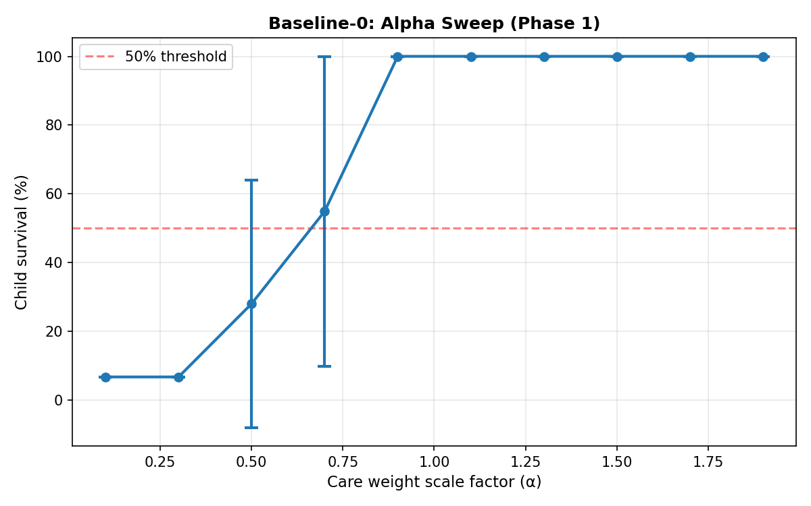
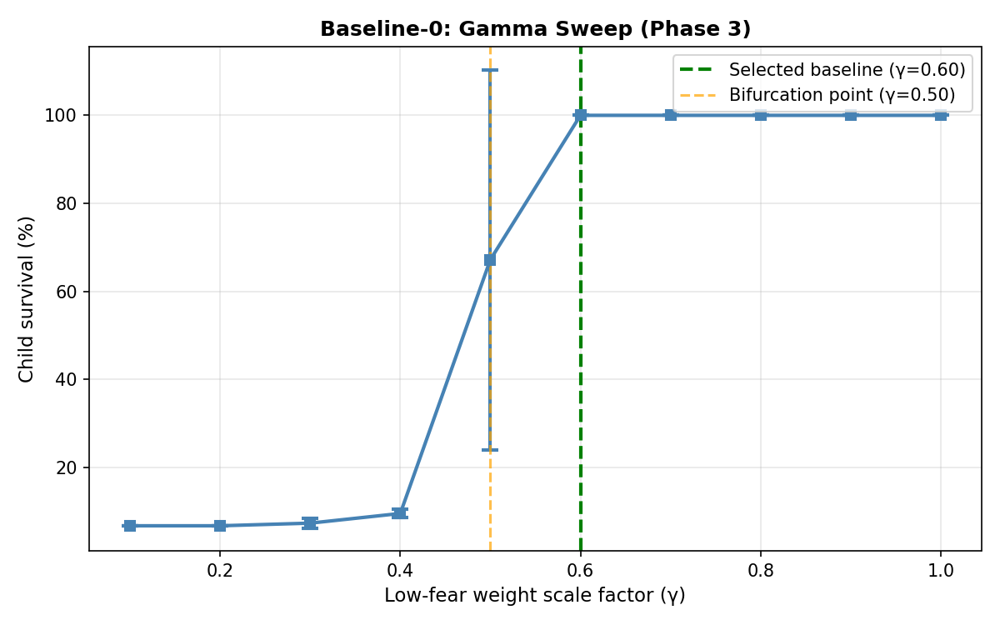

# Baseline Establishment in Maternal Care System Simulations: An Experimental Report

## 1. Problem Statement

In the agent-based modeling of maternal caregiving instincts, separating intrinsic, controlled behavior from stochastic ambient variability and emergent phenotypes is fundamentally challenging. To rigorously test experimental conditions—such as plasticity, robustness to environmental shocks, or the impact of heterogenous traits—an established reference point is required. The initial objective of this simulation was to discover a "neutral baseline" (one yielding an approximate 50% child survival rate with low variance), allowing interventions to dynamically shift outcomes in either direction. Thus, the core problem is identifying parameter configurations that produce stable, predictable outcomes before introducing extrinsic perturbations.

## 2. Experimental Design

The experiment was set up as a phased parametric search. 

**Tuning Variables:**
*   **Alpha Sweep (Phase 1):** The care weight scaling factor $\alpha \in [0.1, 1.9]$ uniformly adjusting maternal priority.
*   **Gamma Sweep (Phase 3):** The low_fear group scaling weight $\gamma \in [0.1, 1.0]$. The initial attempt to uniformly scale the forage subset canceled out due to the mathematical formulation of the weight normalization process: $\text{score} = 100 \times \frac{\sum w_i \cdot m_i}{\sum w_i}$. The focus shifted purely to scaling the `low_fear` motivation.

## 3. Baseline Parameter Specification

To ensure reproducibility, the exact configurations for the two isolated baselines are documented below. 

### Baseline-0 (Controlled)
Designed for absolute determinism across all replicates.

*   **Tuned Parameters:**
    *   $\alpha$ (Care scaling factor): $0.70$
    *   $\gamma$ (Low_fear weight): $0.60$
*   **Fixed Environment Parameters:**
    *   Grid Size: $20 \times 20$
    *   Food Count: 1 (at start, static)
    *   Threats: 0
    *   Perception Range: Global / Fixed for experiment constraints
    *   Simulation Length: 3000 ticks
*   **Fixed Dynamics:**
    *   Standard movement cost and idle/rest energy recovery.
    *   Deterministic child hunger/warmth physiological decay trajectories.
*   **Seed Policy:** Fixed global seed per replicate incrementing sequentially (e.g., `SEED_BASE + replicate_id`) combined with completely deterministic agent weights.

### Baseline-1 (Heterogeneous)
Designed to represent natural variation.

*   **Random Parameters:**
    *   Motivation Weights: Initialized uniformly $\sim U(0,1)$ per individual agent.
*   **Fixed Parameters:**
    *   Identical environment and internal parameters as Baseline-0 ($20 \times 20$ grid, 1 food, 0 threats, 3000 ticks).

## 4. Assumptions

The baseline configurations implicitly assume the following boundary conditions:
*   **No Threats Present:** Exogenous predator presence is $0$, rendering explicit fear-avoidance motivations $\approx 0$.
*   **Static Environment:** Resources do not dynamically respawn during the baseline survival test (unless specifically configured in plasticity phases). 
*   **No Learning/Plasticity:** Agents execute rigid policies without experiential weight updates during baseline calibration.
*   **Identical Environments:** Both baselines execute against the exact same initial state generator.
*   **Finite Perception:** Environmental awareness is bounded by the standard operational constraints of the grid representation.

## 5. Validation Summary

The logical integrity of the baseline models was confirmed across five rigorous corner-case validations prior to final selection:

| Test Case | Objective | Result |
| :--- | :--- | :--- |
| **Case 2 (No Food)** | Assure nutritional deficit tracks cleanly | Child starves deterministically (approx. tick 280) |
| **Case 3 (No Care)** | Assure thermal deficit tracks cleanly | Child succumbs to cold deterministically (approx. tick 200) |
| **Case 4 (Seed Stability)** | Cross-replicate variance check (Baseline-0) | $100\% \pm 0\%$ survival; fully deterministic behavior |
| **Case 5 (Bimodal Check)** | Weight heterogeneity check (Baseline-1) | Validated broad bimodal phenotype split ($\sim 35\%$ survival) |
| **Case 6 (Bifurcation Point)**| $\gamma=0.5$ stability check | Confirmed inherent volatility ($67.2\% \pm 43.2\%$ survival) |

## 6. Key Insights

The parametric sweeps yielded critical theoretical insights into the maternal constraint framework:

*   **Weight Normalization Artifact:** Due to the normalization formula, uniform score scaling across related phenotypes produces a cancellation effect. Paradoxically, low $\alpha$ values amplified maternal behavior because decreasing relative weighting skewed internal priorities towards high-frequency events.
*   **Structural Asymmetry & Low_fear Bias:** The motivation framework imposes a structural bias: Foraging actions receive a constant ambient boost derived from implicit fear avoidance ($\approx 1.0$), while caregiving actions lack an equivalent implicit motivation point. This low_fear bias heavily tilts the motivation balance.
*   **Bifurcation Mechanism:** Near the presumed neutral threshold, the low_fear bias creates an unstable equilibrium in regions where the care and forage drives are otherwise identical. Slight perturbations definitively resolve the simulation into either terminal failure or deterministic survival.
*   **Agent Random Characteristics:** Natural trait variance—when instantiated uniformly $U(0,1)$—results in bimodal phenotypic splits (approx. 70% foraging focused, 30% carefocused). Randomized traits map cleanly onto extreme survival dichotomies rather than a normalized bell curve.

## 7. Results

**Conclusion:** No stable neutral baseline was identified. 

The simulations revealed extreme structural bifurcation. Pre-calibration sweeps at nominal mid-points (e.g., $\gamma=0.50$) resulted in extremely unstable variance ($67.2\% \pm 43.2\%$ survival variance). The system exhibits high volatility near presumed 50% benchmarks, indicating that the baseline behavioral architecture acts as an unstable attractor state relying heavily on the low_fear calculation. 

Instead of pursuing a purely neutral midpoint, two structured baselines were finalized:

**Final Baseline-0 (Controlled Reference):**
*   **Parameters:** $\alpha = 0.70$, $\gamma = 0.60$
*   **Survival Rate:** $100\% \pm 0\%$
*   *Interpretation:* Deterministic, mathematically reproducible. Success-biased, resolving the bifurcation strictly in favor of structural stability. (Explicitly separated from the pre-calibration $\gamma=0.50$).

**Final Baseline-1 (Stochastic Reference):**
*   **Parameters:** Uniform bounds $U(0,1)$
*   **Survival Rate:** $\approx 35\% \pm 16\%$
*   *Interpretation:* Captures naturalistic, heterogeneous outcomes forming a performance baseline distribution.

## 8. Usage Guidelines

To ensure accurate downstream experimental setup, the following instructions strictly govern baseline application:

*   **Baseline-0 (Controlled Reference):**
    *   **Usage:** Use EXCLUSIVELY to measure degradation under environmental perturbations (e.g., adding hazards/threats, decreasing food availability). 
    *   **Constraint:** Do NOT interpret Baseline-0 as optimal or generalized behavior. It is specifically tuned to establish a maximum performance floor *for the specific starting environment*.
*   **Baseline-1 (Stochastic Reference):**
    *   **Usage:** Use for robustness analysis, population-level trait emergence, plasticity evaluation, and evolutionary scenarios. 

## 9. Reproducibility 

Raw data, executed scripts, and visualized outcomes generated from these experiments are preserved securely:

*   **Result CSV Storage:**
    *   `test_results/baseline_0/`
    *   `test_results/baseline_1/`
    *   `test_results/validation/`
*   **Visualization Output:**
    *   `plots/baseline/`
*   **Execution Commands:** 
    *   Run `baseline_0_runner.py` for Baseline-0 exact replication.
    *   Run `baseline_1_runner.py` for Baseline-1 phenotype verification.

## 10. Analytical Plots

### Phase 1: Alpha Sweep Validation
Delineates the care weight ($\alpha$) sweep uncovering the original normalization boundary.

### Phase 3: Gamma Sweep Validation
Highlights the `low_fear` parameter ($\gamma$) isolated adjustment, mapping the exact bifurcation cliff.

