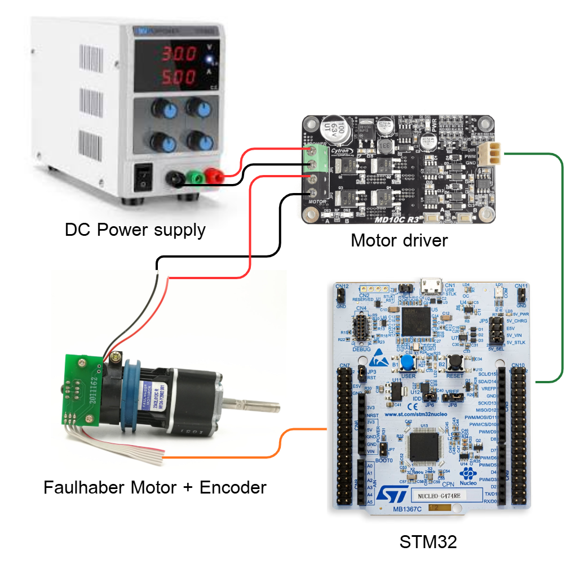
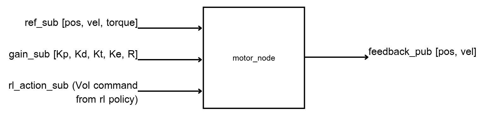
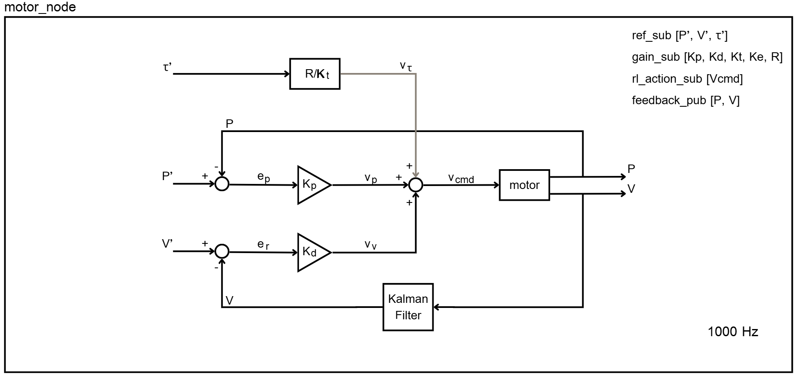

# Faulhaber Motor Controller (STM32G474RE + micro-ROS)

## Project Overview

This micro-ROS firmware implements a **Faulhaber DC motor controller** running on **STM32G474RE** using **micro-ROS**.  
The controller uses the **MIT position–velocity–torque control law** to enable:

- **Position tracking**
- **Velocity control**
- **Torque control**

It publishes real-time motor states at **100 Hz**, including:

- Motor position (rad)  
- Motor velocity (rad/s, Kalman-filtered)  
- Commanded voltage  

This module can operate using the classical MIT controller or be replaced by an **RL policy voltage command** for Sim2Real evaluation.

---

## Hardware Setup



The hardware consists of four main components connected together to form the motor control system:

1. **DC Power Supply**  
   Provides the motor driver with regulated voltage.  
   This powers both the Faulhaber motor and the control electronics on the driver board.

2. **Motor Driver**  
   Takes the PWM and direction signals from the STM32 and drives the Faulhaber DC motor.  
   It supplies sufficient current while protecting the MCU.

3. **Faulhaber Motor + Encoder**  
   The Faulhaber motor provides mechanical output, while the attached encoder outputs  
   high-resolution quadrature signals (A/B channels) used for precise position and velocity estimation.

4. **STM32G474RE**  
   Runs the micro-ROS node, reads the encoder, computes MIT control or RL policy,  
   sends PWM + direction commands to the motor driver, and publishes motor feedback.

This hardware layout enables real-time closed-loop control with micro-ROS communication.

---

## System Architecture



### Inside the `motor_node`


The diagram shows the internal control architecture executed at **1000 Hz** on the STM32.  
There are three inputs from ROS 2 and one output:

- `ref_sub  = [P*, V*, τ*]`      → reference position, velocity, torque  
- `gain_sub = [Kp, Kd, Kt, Ke, R]` → MIT controller gains  
- `rl_action_sub = [Vcmd]`      → optional RL voltage command  
- `feedback_pub = [P, V]`       → motor position and velocity back to ROS

#### Control Flow:

1. **Position Error Path**
   - Compute position error: `e_p = P* − P`
   - Multiply by proportional gain: `v_p = Kp * e_p`

2. **Velocity Error Path**
   - Compute velocity error: `e_r = V* − V`
   - Multiply by derivative gain: `v_v = Kd * e_r`

3. **Torque Feedforward**
   - Convert desired torque to voltage equivalent:  
     `v_τ = τ* * (R / Kt)`

4. **Sum of Commands**
   - Final voltage command:  
     `V_cmd = v_p + v_v + v_τ`  
   - Or if RL mode is enabled:  
     `V_cmd = rl_action_sub`

5. **Motor Actuation**
   - PWM + direction signals drive the motor
   - Encoder measures new position `P` and velocity `V`

6. **Velocity Filtering**
   - Raw velocity → Kalman Filter → smooth estimate  
   - Feedback loop uses this filtered velocity for stability

This control loop provides stable motor control and allows seamless switching between classical MIT control and RL-based voltage control.

---

## Processing Pipeline

1. **Encoder Read (TIM3)**
   - Read raw encoder ticks  
   - Perform wrap-around correction  
   - Compute continuous angle across multiple revolutions  

2. **Velocity Estimation**
   - Convert tick difference to radians  
   - Feed continuous angle into **Kalman Filter**  
   - Produce smooth, noise-reduced velocity output  

3. **Motor Control**
   - MIT controller computes voltage:  
     ```
     V = Kp*(pos_ref − pos) + Kd*(vel_ref − vel) + torque_ref*(R/Kt)
     ```
   - Alternatively: RL policy provides `V_cmd` directly  

4. **PWM Motor Output (TIM8)**
   - Map V_cmd to PWM duty  
   - Control motor direction via GPIO  

5. **Publish Motor State → ROS 2**
   - `[pos, vel, V_cmd]` at 100 Hz  

6. **Receive Commands ← ROS 2**
   - `/reference_subscription`: ref position / velocity / torque  
   - `/gain_subscription`: MIT controller gains  
   - `/rl_action_subscription`: RL voltage command  

---
## ROS Node

| Node Name       | Description |
|----------------|-------------|
| **motor_node** | Runs MIT controller or RL policy, processes encoder & Kalman Filter, drives motor, and communicates with ROS 2 |

---

## ROS Topics

### Publishers

| Topic                     | Type                           | Description |
|--------------------------|----------------------------------|-------------|
| `/motor_feedback_publisher` | `std_msgs/Float32MultiArray` | `[pos, vel, V_cmd]` published at 100 Hz |

### Subscribers

| Topic                       | Type                           | Description |
|----------------------------|----------------------------------|-------------|
| `/reference_subscription`  | `std_msgs/Float32MultiArray`   | `[pos_ref, vel_ref, torque_ref]` |
| `/gain_subscription`       | `std_msgs/Float32MultiArray`   | `[Kp, Kd, Kt, Ke, R]` for MIT controller |
| `/rl_action_subscription`  | `std_msgs/Float32MultiArray`   | `[V_cmd]` voltage command from RL policy |

---

## Project Structure

The firmware project follows the standard STM32CubeIDE layout with additional micro-ROS utilities.  
Below is the structure and the purpose of each important directory:
```
motor_controller/
│── Core/
│── Debug/
│── Drivers/
│── micro_ros_stm32cubemx_utils/
│── Middlewares/
│── src/main.c        ← MIT controller + Kalman + ROS executor
.
.
.
```

---

## Setup and Usages
After you clone workspace and build it already, then do this step for setup STM micro-controller and usages of this project.

1. Upload Code from 
`motor_controller/src/main.c` into STM32 g474 RE

2. Connect MicroROS with ROS2

**Must have micro-ros package before do this step**  
Micro-ros document : https://github.com/micro-ROS/micro_ros_setup?tab=readme-ov-file 

```bash
ros2 run xxxxxx
```

3. Verify MicroROS agent connect with ROS2 
```bash
ros2 topic echo /xxxxx
```
this topic will display about motor feedback (pos, velo, vol_cmd) if you can see the data sent continuously that mean it's ready to do next step

4. Changing Gain for (Kp, Kd)
```bash
ros2 topic pub /gain xxxxxxxx
```

5. Command the refence signal (pos, velo, torque)
```bash
ros2 topic pub /ref xxxxxxxx xxxxx xxxxx
```


## Experiment & Results
### input VDO this part !!!

- Position control (Only Kp gain)

   - 0-25 radian    
   - 25-0 radian
   - 0-10 radian with error

- Torque feedforward find velocity variance (Physical AI usage)
   - 0.0 - 6.0 (0.5 per step)
   

   This figure justifies modeling motor velocity noise as a torque-dependent Gaussian, with SD obtained from the linear fit of measured velocity variability. The red dashed line is the key artifact: it converts experimental data into a deployable noise model for simulation RL training.


## Notes

- micro-ROS agent must be running before this firmware communicates.

- Default control frequency: 1000 Hz (control loop), 100 Hz (publish loop).

- PWM output is saturated to ±12 V (motor supply voltage).

- Kalman Filter parameters are tuned for the Faulhaber gearmotor.


---
## Author  
Natthanicha T.  
Field Robotics (FIBO), King Mongkut’s University of Technology Thonburi