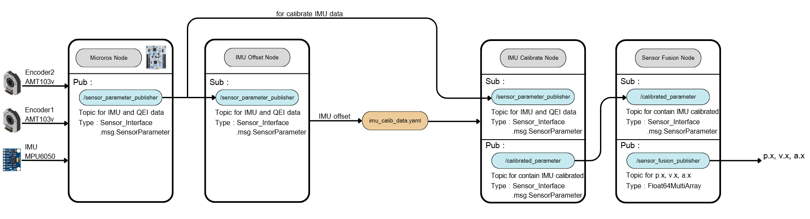

# 1-Leg Robot Sensor Fusion System  
### (STM32G474RE + micro-ROS + IMU Calibration + 1-D Kalman Filter)

## Project Overview

This system implements a **complete sensor fusion pipeline** for a 1-leg robotic locomotion testbed. It integrates three major components:

1. **STM32 micro-ROS Firmware**  
   Publishes raw IMU (MPU6050) data and raw encoder ticks.

2. **IMU Calibration Framework**  
   - **IMU Offset / Calibration Collector Node** — collects stationary IMU data and computes offsets and covariance  
   - **IMU Calibration Application Node** — applies stored calibration to live IMU data

3. **Sensor Fusion Node (1-D Kalman Filter)**  
   Estimates translational motion states:
   - Linear position  
   - Linear velocity  
   - Accelerometer bias  

**Important:**  
The encoder measures **only translational X displacement along the rail**.  
No joint encoder is used in this system.

These fused states serve as the **observation inputs for RL locomotion policies** and support Sim2Real transfer.

---

## Table of Contents

1. [Hardware Setup](#hardware-setup)
2. [System Architecture](#2-system-architecture)
3. [STM32 Firmware](#3-stm32-firmware-micro-ros-publisher)
4. [IMU calibration Framework](#4-imu-calibration-framework)
5. [Sensor Fusion Node](#5-sensor-fusion-node)
6. [Kalman Filter](#6-1-d-kalman-filter-explanation)
7. [Project Structure](#7-project-structure)
8. [Setup & Usages](#8-setup-and-usages)
8. [Experiments & Results](#9-experiment--results)
9. [Notes](#10-notes)

## 1. Test Station Hardware


The physical setup includes:

1. **1-Leg Robotic Structure**  
   Constrained to move only along the **X-axis** on a linear guide rail.

2. **MPU6050 IMU**  
   Provides 3-axis linear acceleration and angular velocity.

3. **Linear Encoder (TIM5)**  
   - Mounted directly on the sliding rail carriage  
   - Measures **pure X-axis displacement**, not joint rotation  

4. **STM32G474RE (micro-ROS)**  
   - Reads IMU data via I²C  
   - Reads encoder counters  
   - Publishes raw sensor data at **100 Hz** to ROS 2

---

## 2. System Architecture



### Pipeline Overview

1. **STM32 micro-ROS Node**  
   Publishes raw IMU + encoder via `/sensor_parameter_publisher`.

2. **IMU Calibration Collector Node**  
- Collects ~10,000 stationary samples  
- Computes:
  - Accelerometer offset
  - Gyroscope offset
  - Accelerometer covariance
  - Gyroscope covariance  
- Saves results to:
  ```
  imu_calib_data.yaml
  ```

3. **IMU Calibration Application Node**  
- Loads calibration parameters from YAML  
- Subtracts offsets from incoming IMU data  
- Republishes calibrated IMU + encoder data on:
  ```
  /calibrated_parameter
  ```

4. **Sensor Fusion Node (Kalman Filter)**  
- Fuses encoder position with calibrated IMU acceleration  
- Publishes fused state estimates on:
  ```
  /sensor_fusion_publisher
  ```

---

## 3. STM32 Firmware (micro-ROS Publisher)

### Purpose
Collects IMU + encoder data at 100 Hz and publishes them to ROS 2.

### Published Topic

| Topic | Type | Description |
|-------|------|-------------|
| `/sensor_parameter_publisher` | `sensor_interface/msg/SensorParameter` | Raw IMU + encoder ticks |

### 100 Hz Timer Loop

Inside `timer_callback()`:

- Refresh watchdog  
- Read MPU6050  
- Read encoder1 + encoder2  
- Convert accelerations to m/s²  
- Convert gyro rates to rad/s  
- Add ROS timestamp  
- Publish `SensorParameter`  

This is the **entry point** of the sensing pipeline.

---

## 4. IMU Calibration Framework

### 1. Calibration Collector Node  
*(File: `imu_offset_node.py`)*

This node **must be run while the robot is fully stationary**.

It:
1. Subscribes to raw IMU data
2. Collects a fixed number of samples
3. Computes:
   - Mean offsets
   - Covariance matrices
4. Writes results to `imu_calib_data.yaml`

Stored parameters:
```yaml
accel offset
accel covariance
gyro offset
gyro covariance
```

### 2. Calibration Application Node
*(File: `imu_calibrate.py`)*

This node:
- Loads calibration parameters from YAML
- Subtracts offsets from incoming IMU data
- Republishes calibrated IMU and raw encoder values

Published topic:

| Topic | Type |
|-------|------|
| `/calibrated_parameter` | `SensorParameter` | 


## 5. Sensor Fusion Node  
### (1-D Kalman Filter for Translational X Motion)

### Subscribed Topic

| Topic | Description |
|--------|-------------|
| `/calibrated_parameter` | Linear encoder + calibrated IMU |

### Published Topic

| Topic | Type |
|--------|-------|
| `/sensor_fusion_publisher` | `std_msgs/Float64MultiArray` |

**Output format:**  

```
[p_x, v_x, b_ax]
```

---


## 6. 1-D Kalman Filter Explanation

The sensor fusion system uses a **1-dimensional Kalman filter** to estimate linear motion along the X-axis by combining:

- IMU acceleration (high-frequency, noisy, contains bias)
- Encoder position (accurate, high-trust measurement)

The filter outputs three fused states:

- `p_x` — linear position  
- `v_x` — linear velocity  
- `b_ax` — estimated IMU accelerometer bias  

---

### State Vector

The filter maintains the following state:

```math
\mathbf{x} =
\begin{bmatrix}
p_x \\
v_x \\
b_{ax}
\end{bmatrix}
```


Which represents:

- `p_x`: Position (meters)  
- `v_x`: Velocity (m/s)  
- `b_ax`: IMU acceleration bias  

---

### Prediction Model


The filter predicts the next state using the measured IMU acceleration:

$$
\mathbf{x}_{k+1} = A \mathbf{x}_k + B a_{imu}
$$

Where:


$$
A =
\begin{bmatrix}
1 & dt & -\frac{1}{2} dt^2 \\
0 & 1  & -dt \\
0 & 0  & 1
\end{bmatrix}
$$


$$
B =
\begin{bmatrix}
\frac{1}{2} dt^2 \\
dt \\
0
\end{bmatrix}
$$

This models:

- Integration of velocity → position  
- Integration of acceleration → velocity  
- Effect of bias on acceleration  

In code:

<!-- ```self.x = self.A @ self.x + self.B @ u``` -->

```python
self.x = self.A @ self.x + self.B @ a_imu
```


---

### Process Noise (Q Matrix)

The Q matrix accounts for:

- IMU noise (`co_a`)
- Bias drift (`co_ba`)

$$
Q =
\begin{bmatrix}
\sigma_p^2 & \sigma_{pv} & 0 \\
\sigma_{pv} & \sigma_v^2 & 0 \\
0 & 0 & \sigma_{ba}
\end{bmatrix}
$$

The values depend on the IMU covariance stored in:
```imu_calib_data.yaml```


---

### Measurement Model (Encoder)

The encoder measures **only position**:

$$
z = p_x
$$

Which yields measurement matrix:

$$
C = \begin{bmatrix} 1 & 0 & 0 \end{bmatrix}
$$

Update step:

$$
y = z - Cx
$$

$$
S = C P C^T + R
$$

$$
K = P C^T S^{-1}
$$

$$
x = x + K y
$$

$$
P = (I - K C) P
$$

---

### Additional Fusion Logic

#### **1. Encoder Wrap-Around Handling**
Handles 32-bit hardware counter rollover from TIM5.

#### **2. Static Velocity Lock**
If encoder velocity remains below threshold:  
→ Force `v_x = 0`  
Improves stability on small vibrations.

#### **3. Accelerometer Deadband**
If IMU acceleration is extremely small:  
→ Replace measurement with bias estimate  
Prevents jitter from low-noise IMU drift.

---

## 7. Project Structure

```
firmware/
│── sensor_fusion/
    │── core/src/main.c          ← micro-ROS IMU + encoder publisher

src/
│── imu_calibration
    │── config/                  ← collect .yaml from 'imu_offset_node.py'
    ...
    │── script/
        │── imu_calibrate.py     ← publish calibrated IMU data
        │── imu_offset_node.py   ← collect data and compute offset, covaiance
        │── sensor_fusion.py     ← publish fused data

│── imu_caliration_interfaces
    │── ...
    │── srv/                  
        │── IMUParamteres.srv    ← custom service

│── sensor_interace
    │── ...
    │── msg/
        │── SensorOutput.msg     ← custom msg
        │── SensorParameter.msg  ← custom msg
```


## 8. Setup and Usages
After you clone workspace and build it already, then do this step for setup STM micro-controller and usages of this project.

1. Upload Code from 
`firmware/sensor_fusion/Core/src/main.c` into STM32 g474 RE

2. Connect MicroROS with ROS2

**Must have micro-ros package before do this step**  
Micro-ros document : https://github.com/micro-ROS/micro_ros_setup?tab=readme-ov-file 

```bash
sudo chmod 666 /var/run/docker.sock
ros2 run xxxxxx
```

3. Verify MicroROS agent connect with ROS2 
```bash
ros2 topic echo /xxxxx
```

4. Run Collect IMU Offset and Covaiance Node
```bash
# Run and wait until it Collect all data
ros2 run xxxx
```

5. Run Calibrate IMU node
```bash
# Run this after done collect IMU offset/Covariance or has an `imu_calib_data.yaml` already

ros2 run xxxx 
```

6. Run Sensor fusion node
```bash
# Run this node after run `imu_calibrate.py` already

ros2 run xxxx
```

## 9. Experiment & Results


## 10. Notes

- Encoder measures **only linear displacement**, not joint angles.  
- Calibration must be performed with the robot **fully stationary**.  
- Sensor fusion runs at **100 Hz**.  
- Encoder is weighted highly in the Kalman model (`co_e` small).  
- IMU noise and bias are estimated dynamically.  
- Designed for **Sim2Real RL observation pipelines**.

---

## Author

**Natthanicha T.**  
Field Robotics (FIBO),  
King Mongkut’s University of Technology Thonburi (KMUTT)
